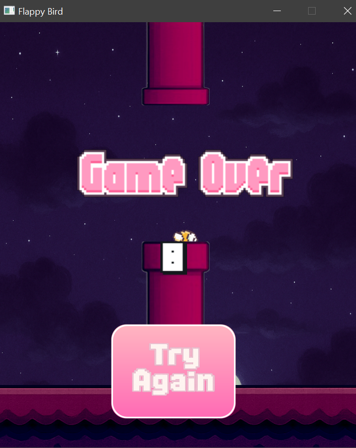

# FlappyBird
*Welcome to my first JavaFX project ever!* 

A Flappy Bird clone made with JavaFX in Eclipse IDE. Includes custom game physics, scoring, obstacle generation &amp; a night mode transition every 5 scores.
---
## Features
- JavaFX-based game UI
- Gravity & jump physics
- Collision detection
- Scoring system
- Night mode toggle after every 5 points
- Sound effects
- Wings animation

## Screenshots

### 1. Game Start


### 2. Gameplay


### 3. Night Mode Transition


### 4. Game Over


## How to Run
1. Clone the repo: 
```bash
git clone https://github.com/DeaXhavara/FlappyBird.git
```
2. Open the project in Eclipse 
3. Make sure JavaFX SDK is correctly configured (This is one of the most important steps!)
4. Run the "Main.java" file
---
## ⚠️ JavaFX Setup Warning

**JavaFX setup is often the reason a project "doesn't work".**

This project was built using **JavaFX SDK 23**, and it should work with:
- Java **17**
- Java **21**
- Java **23** (not officially supported by JavaFX team yet)

### Setup Checklist:
1. Download JavaFX SDK 23: [https://gluonhq.com/products/javafx/](https://gluonhq.com/products/javafx/)
2. In Eclipse, add the SDK to your **module path**.
3. Add this to your VM arguments:
```bash
--module-path /path/to/javafx-sdk-23/lib --add-modules javafx.controls,javafx.fxml
```
4. Still stuck? Feel free to open an issue on the repo.
---
# About the Project

This was my **first ever JavaFX project**, built from scratch in **Eclipse IDE**.
It was a personal challenge to explore GUI development and event-driven programming using Java.

I'm passionate to learn more about AI, computing, and creative technology, this is just the start of a much bigger journey.

Feel free to check out the code. Feedback is welcome!

---

## Author
**Dea Xhavara**
- [LinkedIn](https://www.linkedin.com/in/deaxhavara)
